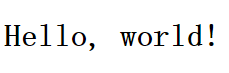

## Learning Guide Of React

#### demo1--使用bower实现react一个的demo

##### 1-1、工程目录
* app
	* bower_components
	* index.html
* bower.json
* .bowerrc

##### 1-2、初始化bower并安装所需文件
1、`bower install react --save`

2、`bower install babel-standalone --save`

##### 1-3、HTML模板
```html
<!DOCTYPE html>
<html>
<head lang="en">
    <meta charset="UTF-8">
    <title></title>
    <script src="bower_components/react/react.min.js"></script>
    <script src="bower_components/react/react-dom.min.js"></script>
    <script src="bower_components/babel-standalone/babel.min.js"></script>
</head>
<body>
    <div id="example"></div>
    <script type="text/babel">
    ReactDOM.render(
        <h1>Hello, world!</h1>,
        document.getElementById('example')
        );
    </script>
</body>
</html>
```

其中：

* react.min.js:是React的核心库
* react-dom.min.js:是提供与DOM相关的功能
* babel.min.js:是将JSX语法转为JavaScript语法

在浏览器中打开index.html页面，可看到如下结果:



##### 1-4、引入jsx文件
在app文件夹下新建main.jsx，在html中引入：
```html
<!DOCTYPE html>
<html>
<head lang="en">
    <meta charset="UTF-8">
    <title></title>
    <script src="bower_components/react/react.min.js"></script>
    <script src="bower_components/react/react-dom.min.js"></script>
    <script src="bower_components/babel-standalone/babel.min.js"></script>
</head>
<body>
    <div id="example"></div>
    <script src="js/main.jsx" type="text/babel"></script>
</body>
</html>
```

main.jsx文件

```jsx
var names = ['Alice', 'Emily', 'Kate'];

ReactDOM.render(
    <div>
  	{
      names.map(function (name) {
          return <div>Hello, {name}!</div>
      })
    }
    </div>,
    document.getElementById('example')
);
```
#### demo2 --使用webpack结合react

##### 2-1、初始化工程
1、安装必须文件

`npm install react react-dom --save`

2、安装开发依赖文件

`npm install webpack --save-dev`

`npm install babel-loader --save-dev`

`npm install css-loader --save-dev`

`npm install style-loader --save-dev`

`npm install babel-core --save-dev`

`npm install babel-preset-es2015 --save-dev`

`npm install babel-preset-react --save-dev`

3、编写webpack.config.js文件

```js
var webpack = require('webpack');

module.exports = {
    entry: './app/main.js',
    output: {
        path: __dirname+"/build/",
        filename: 'bundle.js'
    },
    module: {
        loaders: [
            {
                test: /\.js[x]?$/,
                loader: 'babel-loader',
                query: {
                    presets: ['react','es2015']
                }
            },
            {
                test: /\.css$/,
                loader: 'style!css'
            }
        ]
    }
};
```
4、新建app/main.js和product.js

main.js

```js
import React from 'react';
import ReactDOM from 'react-dom';
import Product from './product';

ReactDOM.render(
    <Product />,
    document.getElementById("root")
);
```

product.js

```
import React from 'react';

export default class Product extends React.Component {
    render() {
        return (
            <h1>Hello world</h1>
        )
    }
}
```

5、执行webpack命令成功之后打开build/index.html文件即可看到结果。

##### 2-2、使用webpack-dev-server
1、安装

`npm install webpack-dev-server --save-dev`

2、编写server.js文件

```js
var path = require('path');
var webpack = require('webpack');
var webpackDevServer = require('webpack-dev-server');
var webpackCfg = require('./webpack.config');
var compiler = webpack(webpackCfg);

var app = new webpackDevServer(compiler, {
    publicPath: webpackCfg.output.publicPath
});

app.listen(9090, "localhost", function(err) {
    if (err) {
        console.log(err);
    }
});
```

然后在浏览器中输入http://localhost:9090/build即可看到结果
